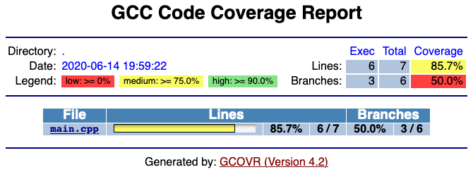
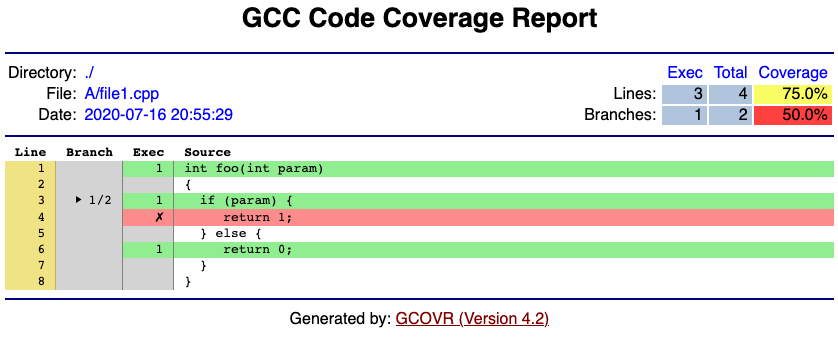

gcovr
=====

generate GCC code coverage reports

`website and documentation <website_>`__ • bugtracker_ • `GitHub <repo_>`__

|GitHub-Actions-badge| |pypi-badge| |codecov-badge| |gitter-badge|

.. begin abstract

Gcovr provides a utility for managing the use of the GNU gcov_ utility
and generating summarized code coverage results. This command is
inspired by the Python coverage.py_ package, which provides a similar
utility for Python.

The ``gcovr`` command can produce different kinds of coverage reports:

.. list-table::
   :header-rows: 1

   * - CLI Option
     - User Guide
     - Description

   * - default, |abstract-option-txt|
     - |abstract-guide-txt|
     - compact human-readable summaries

   * - |abstract-option-html|
     - |abstract-guide-html|
     - overview of all files

   * - |abstract-option-html-details|
     - |abstract-guide-html-details|
     - annotated source files

   * - |abstract-option-cobertura|
     - |abstract-guide-cobertura|
     - machine readable XML reports in Cobertura_ format

   * - |abstract-option-sonarqube|
     - |abstract-guide-sonarqube|
     - machine readable XML reports in Sonarqube format

   * - |abstract-option-json|
     - |abstract-guide-json|
     - JSON report with source file structure and coverage

   * - |abstract-option-json-summary|
     - |abstract-guide-json-summary|
     - JSON summary coverage report

   * - |abstract-option-csv|
     - |abstract-guide-csv|
     - CSV report summarizing the coverage of each file

   * - |abstract-option-coveralls|
     - |abstract-guide-coveralls|
     - machine readable JSON report in Coveralls_ format

Thus, gcovr can be viewed
as a command-line alternative to the lcov_ utility, which runs gcov
and generates an HTML-formatted report.
The development of gcovr was motivated by the need for
text summaries and XML reports.

.. _gcov: https://gcc.gnu.org/onlinedocs/gcc/Gcov.html
.. _coverage.py: https://coverage.readthedocs.io/en/stable/
.. _cobertura: http://cobertura.sourceforge.net/
.. _lcov: http://ltp.sourceforge.net/coverage/lcov.php
.. _coveralls: https://coveralls.io/

.. end abstract

.. The above table contains links into the documentation.
.. Here are the default targets that are used for rendering on GH or on PyPI.
.. The targets for within the Sphinx docs are given in doc/source/index.rst

.. |abstract-option-txt| replace:: ``--txt``
.. |abstract-option-html| replace:: ``--html``
.. |abstract-option-html-details| replace:: ``--html-details``
.. |abstract-option-cobertura| replace:: ``--cobertura``
.. |abstract-option-sonarqube| replace:: ``--sonarqube``
.. |abstract-option-json| replace:: ``--json``
.. |abstract-option-json-summary| replace:: ``--json-summary``
.. |abstract-option-csv| replace:: ``--csv``
.. |abstract-option-coveralls| replace:: ``--coveralls``

.. |abstract-guide-txt| replace:: `Text Output <https://gcovr.com/en/stable/output/txt.html>`__
.. |abstract-guide-html| replace:: `HTML Output <https://gcovr.com/en/stable/output/html.html>`__
.. |abstract-guide-html-details| replace:: `HTML Output <https://gcovr.com/en/stable/output/html.html>`__
.. |abstract-guide-cobertura| replace:: `Cobertura XML Output <https://gcovr.com/en/stable/output/cobertura.html>`__
.. |abstract-guide-sonarqube| replace:: `Sonarqube XML Output <https://gcovr.com/en/stable/output/sonarqube.html>`__
.. |abstract-guide-json| replace:: `JSON Output <https://gcovr.com/en/stable/output/json.html>`__
.. |abstract-guide-json-summary| replace:: `JSON Output <https://gcovr.com/en/stable/output/json.html>`__
.. |abstract-guide-csv| replace:: `CSV Output <https://gcovr.com/en/stable/output/csv.html>`__
.. |abstract-guide-coveralls| replace:: `Coveralls JSON Output <https://gcovr.com/en/stable/output/coveralls.html>`__

Example HTML summary:

Example HTML details:

.. begin links

.. _website:        https://gcovr.com/
.. _documentation:  website_
.. _repo:       https://github.com/gcovr/gcovr/
.. _bugtracker: https://github.com/gcovr/gcovr/issues
.. |GitHub-Actions-badge| image:: https://github.com/gcovr/gcovr/workflows/Test/badge.svg?branch=master
   :target: https://github.com/gcovr/gcovr/actions?query=workflow%3ATest+branch%3Amaster+event%3Apush
   :alt: GitHub Actions build status
.. |pypi-badge| image:: https://img.shields.io/pypi/v/gcovr.svg
   :target: https://pypi.python.org/pypi/gcovr
   :alt: install from PyPI
.. |codecov-badge| image:: https://codecov.io/gh/gcovr/gcovr/branch/master/graph/badge.svg
   :target: https://codecov.io/gh/gcovr/gcovr/branch/master
   :alt: Codecov status
.. |gitter-badge| image:: https://badges.gitter.im/gcovr/gcovr.svg
   :target: https://gitter.im/gcovr/gcovr
   :alt: Gitter chat

.. end links

Installation
------------

.. begin installation

Gcovr is available as a Python package that can be installed via pip_.

.. _pip: https://pip.pypa.io/en/stable

Install newest stable ``gcovr`` release from PyPI:

.. code:: bash

    pip install gcovr

Install development version from GitHub:

.. code:: bash

    pip install git+https://github.com/gcovr/gcovr.git

.. end installation

Quickstart
----------

.. begin quickstart

GCC can instrument the executables to emit coverage data.
You need to recompile your code with the following flags:

::

    --coverage -g -O0

Next, run your test suite.
This will generate raw coverage files.

Finally, invoke gcovr.
This will print a tabular report on the console.

::

    gcovr

You can also generate detailed HTML reports:

::

    gcovr --html-details coverage.html

Gcovr will create one HTML report per source file next to the coverage.html summary.

You should run gcovr from the build directory.
The ``-r`` option should point to the root of your project.
This only matters if you have a separate build directory.
For example::

    cd build; gcovr -r ..

.. end quickstart

For complete documentation, read the `manual <documentation_>`__.

Contributing
------------

If you want to report a bug or contribute to gcovr development,
please read our contributing guidelines first:
`<https://github.com/gcovr/gcovr/blob/master/CONTRIBUTING.rst>`_

License
-------

.. begin license

Copyright 2013-2021 the gcovr authors

Copyright 2013 Sandia Corporation.
Under the terms of Contract DE-AC04-94AL85000 with Sandia Corporation,
the U.S. Government retains certain rights in this software.

Gcovr is available under the 3-clause BSD License.
See LICENSE.txt for full details.
See AUTHORS.txt for the full list of contributors.

Gcovr development moved to this repository in September, 2013 from
Sandia National Laboratories.

.. end license
