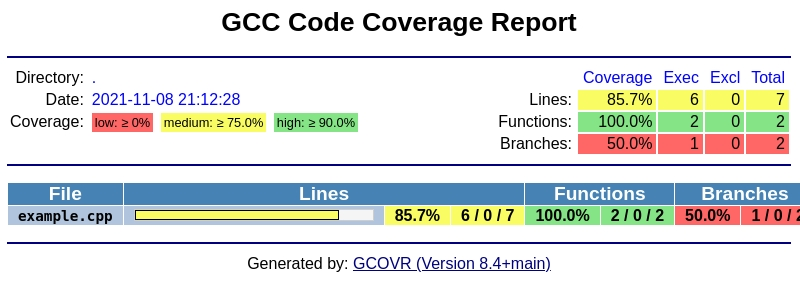

gcovr
=====

generate GCC code coverage reports

`website and documentation <website_>`__ • bugtracker_ • `GitHub <repo_>`__

|GitHub-Actions-badge| |codacy-quality-badge| |codacy-coverage-badge| |pypi-badge| |Readthedocs-badge| |gitter-badge|

.. begin abstract

Gcovr provides a utility for managing the use of the GNU gcov_ utility
and generating summarized code coverage results. This command is
inspired by the Python coverage.py_ package, which provides a similar
utility for Python.

The ``gcovr`` command can produce different kinds of coverage reports:

.. list-table::
   :header-rows: 1

   * - CLI Option
     - User Guide
     - Description

   * - default, |abstract-option-txt|
     - |abstract-guide-txt|
     - compact human-readable summaries

   * - |abstract-option-html|
     - |abstract-guide-html|
     - overview of all files

   * - |abstract-option-html-details|
     - |abstract-guide-html-details|
     - annotated source files

   * - |abstract-option-html-template-dir|
     - |abstract-guide-html-template-dir|
     - use custom set of Jinja2 templates

   * - |abstract-option-csv|
     - |abstract-guide-csv|
     - CSV report summarizing the coverage of each file

   * - |abstract-option-json|
     - |abstract-guide-json|
     - JSON report with source file structure and coverage

   * - |abstract-option-json-summary|
     - |abstract-guide-json-summary|
     - JSON summary coverage report

   * - |abstract-option-clover|
     - |abstract-guide-clover|
     - machine readable XML reports in Clover_ format

   * - |abstract-option-cobertura|
     - |abstract-guide-cobertura|
     - machine readable XML reports in Cobertura_ format

   * - |abstract-option-coveralls|
     - |abstract-guide-coveralls|
     - machine readable JSON report in Coveralls_ format

   * - |abstract-option-jacoco|
     - |abstract-guide-jacoco|
     - machine readable XML reports in JaCoCo_ format

   * - |abstract-option-lcov|
     - |abstract-guide-lcov|
     - machine readable report in LCOV_ info format

   * - |abstract-option-sonarqube|
     - |abstract-guide-sonarqube|
     - machine readable XML reports in SonarQube_ format

Thus, gcovr can be viewed
as a command-line alternative to the lcov_ utility, which runs gcov
and generates an HTML-formatted report.
The development of gcovr was motivated by the need for
text summaries and XML reports.

.. _gcov: https://gcc.gnu.org/onlinedocs/gcc/Gcov.html
.. _coverage.py: https://coverage.readthedocs.io/en/stable/
.. _clover: https://bitbucket.org/atlassian/clover/src/master/
.. _cobertura: https://github.com/cobertura/cobertura/
.. _coveralls: https://coveralls.io/
.. _jacoco: https://www.eclemma.org/jacoco/
.. _lcov: https://github.com/linux-test-project/lcov
.. _sonarqube: https://www.sonarsource.com/products/sonarqube/

.. end abstract

.. The above table contains links into the documentation.
.. Here are the default targets that are used for rendering on GH or on PyPI.
.. The targets for within the Sphinx docs are given in doc/source/index.rst

.. |abstract-option-txt| replace:: ``--txt``
.. |abstract-option-html| replace:: ``--html``
.. |abstract-option-html-details| replace:: ``--html-details``
.. |abstract-option-html-nested| replace:: ``--html-nested``
.. |abstract-option-html-template-dir| replace:: ``--html-template-dir``
.. |abstract-option-csv| replace:: ``--csv``
.. |abstract-option-json| replace:: ``--json``
.. |abstract-option-json-summary| replace:: ``--json-summary``

.. |abstract-option-clover| replace:: ``--clover``
.. |abstract-option-cobertura| replace:: ``--cobertura``
.. |abstract-option-coveralls| replace:: ``--coveralls``
.. |abstract-option-jacoco| replace:: ``--jacoco``
.. |abstract-option-lcov| replace:: ``--lcov``
.. |abstract-option-sonarqube| replace:: ``--sonarqube``

.. |abstract-guide-txt| replace:: `Text Output <https://gcovr.com/en/stable/output/txt.html>`__
.. |abstract-guide-html| replace:: `HTML Output <https://gcovr.com/en/stable/output/html.html>`__
.. |abstract-guide-html-details| replace:: `HTML Output <https://gcovr.com/en/stable/output/html.html>`__
.. |abstract-guide-html-template-dir| replace:: `HTML Output <https://gcovr.com/en/stable/output/html.html>`__
.. |abstract-guide-csv| replace:: `CSV Output <https://gcovr.com/en/stable/output/csv.html>`__
.. |abstract-guide-json| replace:: `JSON Output <https://gcovr.com/en/stable/output/json.html>`__
.. |abstract-guide-json-summary| replace:: `JSON Output <https://gcovr.com/en/stable/output/json.html>`__

.. |abstract-guide-clover| replace:: `Clover XML Output <https://gcovr.com/en/stable/output/clover.html>`__
.. |abstract-guide-cobertura| replace:: `Cobertura XML Output <https://gcovr.com/en/stable/output/cobertura.html>`__
.. |abstract-guide-coveralls| replace:: `Coveralls JSON Output <https://gcovr.com/en/stable/output/coveralls.html>`__
.. |abstract-guide-jacoco| replace:: `JaCoCo XML Output <https://gcovr.com/en/stable/output/jacoco.html>`__
.. |abstract-guide-lcov| replace:: `LCOV info Output <https://gcovr.com/en/stable/output/lcov.html>`__
.. |abstract-guide-sonarqube| replace:: `SonarQube XML Output <https://gcovr.com/en/stable/output/sonarqube.html>`__

Example HTML summary:

Example HTML details:

.. image:: ./doc/images/screenshot-html-details.example.cpp.jpeg

.. begin links

.. _website:        https://gcovr.com/
.. _documentation:  website_
.. _repo:       https://github.com/gcovr/gcovr/
.. _bugtracker: https://github.com/gcovr/gcovr/issues
.. |GitHub-Actions-badge| image:: https://github.com/gcovr/gcovr/actions/workflows/CI.yml/badge.svg?event=push
   :target: https://github.com/gcovr/gcovr/actions/workflows/CI.yml?query=branch%3Amain+event%3Apush
   :alt: GitHub Actions build status
.. |codacy-quality-badge| image:: https://app.codacy.com/project/badge/Grade/c50ef51a78024cf4a3025c464560a534
   :target: https://app.codacy.com/gh/gcovr/gcovr/dashboard?utm_source=gh&utm_medium=referral&utm_content=&utm_campaign=Badge_grade
   :alt: Codacy quality status
.. |codacy-coverage-badge| image:: https://app.codacy.com/project/badge/Coverage/c50ef51a78024cf4a3025c464560a534
   :target: https://app.codacy.com/gh/gcovr/gcovr/dashboard?utm_source=gh&utm_medium=referral&utm_content=&utm_campaign=Badge_coverage
   :alt: Codacy coverage status
.. |pypi-badge| image:: https://img.shields.io/pypi/v/gcovr.svg
   :target: https://pypi.python.org/pypi/gcovr
   :alt: install from PyPI
.. |Readthedocs-badge| image:: https://readthedocs.org/projects/gcovr/badge/?version=latest
   :target: https://gcovr.com/en/latest/?badge=latest
   :alt: Documentation Status
.. |gitter-badge| image:: https://badges.gitter.im/gcovr/gcovr.svg
   :target: https://gitter.im/gcovr/gcovr
   :alt: Gitter chat

.. end links

Installation
------------

.. begin installation

Gcovr is available as a Python package that can be installed via pip_.

.. _pip: https://pip.pypa.io/en/stable

Install newest stable ``gcovr`` release from PyPI:

.. code:: bash

    pip install gcovr

Install development version from GitHub (needs at least version `21.3` of pip):

.. code:: bash

    pip install git+https://github.com/gcovr/gcovr.git

.. end installation

Quickstart
----------

.. begin quickstart

GCC can instrument the executables to emit coverage data.
You need to recompile your code with the following flags:

::

    --coverage -g -O0

Next, run your test suite.
This will generate raw coverage files.

Finally, invoke gcovr.
This will print a tabular report on the console.

::

    gcovr

You can also generate detailed or nested HTML reports:

::

    gcovr --html-details coverage.html
    gcovr --html-nested coverage.html

Gcovr will create one HTML report per source file and for
``--html-nested`` also per directory next to the coverage.html
summary.

You should run gcovr from the build directory.
The ``-r`` option should point to the root of your project.
This only matters if you have a separate build directory.
For example::

    cd build; gcovr -r ..

.. end quickstart

For complete documentation, read the `manual <documentation_>`__.

Contributing
------------

If you want to report a bug or contribute to gcovr development,
please read our contributing guidelines first:
`<https://gcovr.com/en/latest/contributing.html>`_

License
-------

This software is distributed under the 3-clause BSD License.
See `<https://gcovr.com/en/latest/license.html#license-terms>`_ for details.
See `<https://gcovr.com/en/latest/license.html#acknowledgements>`_
for the full list of contributors.
