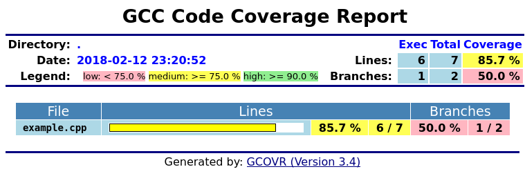

Gcovr User Guide
================

.. github display

    This file does not render correctly on GitHub.
    Please view the user guide for the latest gcovr release at
    http://gcovr.com/guide.html

.. topic:: Abstract

    .. include:: ../README.rst
        :start-after: .. begin abstract
        :end-before: .. end abstract

    This documentation describes Gcovr 3.3.

.. section-numbering::

.. contents::
    :depth: 2

.. footer:: last updated |timestamp|

.. |timestamp| date::

Overview
--------

Gcovr is a Python package that includes a self-contained ``gcovr``
command.  Gcovr is an extension of ``gcov``, a GNU utility that
summarizes the lines of code that are executed - or "covered" -
while running an executable.  The ``gcovr`` command interprets ``gcov``
data files to summarize code coverage in several formats:

-   Text output with coverage statistics indicated with summary statistics and lists of uncovered line, and
-   XML output that is compatible with the Cobertura code coverage utility.
-   HTML output with coverage rates indicated using colored bar graphs.

The `Gcovr Home Page <http://gcovr.com>`__ is
`<http://gcovr.com>`__.
Automated test results are available through
`Travis CI <https://travis-ci.org/gcovr/gcovr>`__ and
`Appveyor <https://ci.appveyor.com/project/latk/gcovr-0p8sb/branch/master>`__.
Gcovr is available under the
`BSD <http://www.gnu.org/licenses/bsd.html>`__ license.

The Gcovr User Guide provides the following documentation:

-   `Getting Started`_: Some simple examples that illustrate how to use Gcovr
-   `The gcovr Command`_: Description of command-line options for ``gcovr``
-   `Installation`_: How to install Gcovr
-   `Status and Future Plans`_: Comments on the past, present and future of Gcovr

Getting Started
---------------

The ``gcovr`` command provides a summary of the lines that have been
executed in a program.  Code coverage statistics help you discover
untested parts of a program, which is particularly important when
assessing code quality.  Well-tested code is a characteristic of
high quality code, and software developers often assess code coverage
statistics when deciding if software is ready for a release.

The ``gcovr`` command can be used to analyze programs compiled with
GCC.   The following sections illustrate the application of ``gcovr``
to test coverage of the following program:

.. include:: examples/example.cpp
    :code: cpp
    :number-lines: 1

This code executes several subroutines in this program,
but some lines in the program are not executed.

Tabular Output of Code Coverage
~~~~~~~~~~~~~~~~~~~~~~~~~~~~~~~

We compile ``example1.cpp`` with the GCC compiler as follows:

.. include:: examples/example.sh
    :code: bash
    :start-after: #BEGIN compile
    :end-before: #END compile

Note that we compile this program without optimization, because
optimization may combine lines of code and otherwise change the
flow of execution in the program.  Additionally, we compile with
the ``-fprofile-arcs -ftest-coverage -fPIC`` compiler options, which
add logic to generate output files that can be processed by the
``gcov`` command.

The compiler generates the ``program`` executable.  When we execute this command:

.. include:: examples/example.sh
    :code: bash
    :start-after: #BEGIN run
    :end-before: #END run

the files ``example1.gcno`` and ``example1.gcda`` are generated.  These
files are processed with by ``gcov`` to generate code coverage
statistics.  The ``gcovr`` command calls ``gcov`` and summarizes these
code coverage statistics in various formats.  For example:

.. include:: examples/example.sh
    :code: bash
    :start-after: #BEGIN gcovr
    :end-before: #END gcovr

generates a text summary of the lines executed:

.. include:: examples/example.txt
    :literal:

Each line of this output includes a summary for a given source file,
including the number of lines instrumented, the number of lines
executed, the percentage of lines executed, and a summary of the
line numbers that were not executed.  To improve clarity, gcovr
uses an aggressive approach to grouping uncovered lines and will
combine uncovered lines separated by "non-code" lines (blank,
freestanding braces, and single-line comments) into a single region.
As a result, the number of lines listed in the "Missing" list may
be greater than the difference of the "Lines" and "Exec" columns.

The ``-r`` option specifies the root directory for the files that are
being analyzed.  This allows ``gcovr`` to generate a simpler report
(without absolute path names), and it allows system header files
to be excluded from the analysis.

Note that ``gcov`` accumulates statistics by line.  Consequently, it
works best with a programming style that places only one statement
on each line.

..
    In ``example.cpp``, the ``MACRO`` macro executes a
    branch, but ``gcov`` cannot discern which branch is executed.

Tabular Output of Branch Coverage
~~~~~~~~~~~~~~~~~~~~~~~~~~~~~~~~~

The ``gcovr`` command can also summarize branch coverage using the ``--branches`` option:

.. include:: ./examples/example_branches.sh
    :code: bash
    :start-after: #BEGIN gcovr
    :end-before: #END gcovr

This generates a tabular output that summarizes the number of branches, the number of
branches taken and the branches that were not completely covered:

.. include:: ./examples/example_branches.txt
    :literal:

XML Output
~~~~~~~~~~

The default output format for ``gcovr`` is to generate a tabular
summary in plain text.  The ``gcovr`` command can also generate an
XML output using the ``--xml`` and ``--xml-pretty`` options:

.. include:: ./examples/example_xml.sh
    :code: bash
    :start-after: #BEGIN gcovr
    :end-before: #END gcovr

This generates an XML summary of the lines executed:

.. include:: ./examples/example_xml.xml
    :code: xml

This XML format is in the
`Cobertura XML <http://cobertura.sourceforge.net/xml/coverage-04.dtd>`__
format suitable for import and display within the
`Jenkins <http://www.jenkins-ci.org/>`__ and `Hudson <http://www.hudson-ci.org/>`__
continuous integration servers using the
`Cobertura Plugin <https://wiki.jenkins-ci.org/display/JENKINS/Cobertura+Plugin>`__.

The ``--xml`` option generates a denser XML output, and the ``--xml-pretty``
option generates an indented XML output that is easier to read.
Note that the XML output contains more information than the tabular
summary.  The tabular summary shows the percentage of covered lines,
while the XML output includes branch statistics and the number of
times that each line was covered.  Consequently, XML output can be
used to support performance optimization in the same manner that
``gcov`` does.

HTML Output
~~~~~~~~~~~

The ``gcovr`` command can also generate a simple
HTML output using the ``--html`` option:

.. include:: ./examples/example_html.sh
    :code: bash
    :start-after: #BEGIN gcovr html
    :end-before: #END gcovr html

This generates a HTML summary of the lines executed.  In this
example, the file ``example1.html`` is generated, which has the
following output:

The default behavior of the ``--html`` option is to generate HTML for
a single webpage that summarizes the coverage for all files.  The
HTML is printed to standard output, but the ``-o`` (``--output``) option
is used to specify a file that stores the HTML output.

The ``--html-details`` option is used to create a separate web page
for each file.  Each of these web pages includes the contents of
file with annotations that summarize code coverage.  Consider the following
command:

.. include:: ./examples/example_html.sh
    :code: bash
    :start-after: #BEGIN gcovr html details
    :end-before: #END gcovr html details

This generates the following HTML page for the file ``example1.cpp``:

.. image:: ./screenshot-html-details.png
    :align: center

Note that the ``--html-details`` option can only be used with the
``-o`` (``--output``) option.  For example, if the ``--output`` option
specifies the output file ``coverage.html``, then the web pages
generated for each file will have names of the form
``coverage.<filename>.html``.

The gcovr Command
-----------------

The ``gcovr`` command recursively searches a directory tree to find
``gcov`` coverage files, and generates a text summary of the code
coverage.  The ``--help`` option generates the following summary of
the ``gcovr`` command line options:

.. include:: examples/gcovr.out
    :literal:

The above `Getting Started`_ guide
illustrates the use of some command line options.

.. admonition:: TODO

    WEH: This section needs to be added to explain the options that
    specify where files are located.

    ## Controlling Coverage

    TODO: document options that control where data files and gcov files
    are found and filtering options for them.

Installation
------------

.. include:: ../README.rst
    :start-after: .. begin installation
    :end-before: .. end installation

The ``gcovr`` script has been tested with many different versions of
CPython 2.7, 3.4, and 3.5, and PyPy 2.7 and 3.5.
The Linux, Windows, and macOS platforms are supported.
Gcovr works with GCC and Clang compilers.

Status and Future Plans
-----------------------

The Gcovr 3.0 release is the first release that is hosted a GitHub.
Previous Gcovr development was hosted at Sandia National Laboratories
as part of the FAST project.  However, Gcovr is now widely used
outside of Sandia, and GitHub will facilitate the integration of
contributions from a wider set of developers.

Acknowledgements
----------------

.. include:: ../AUTHORS.txt

We would like to thank the following organizations for providing
web hosting and computing resources:

-   The development of Gcovr has been partially supported
    by Sandia National Laboratories.  Sandia National Laboratories is
    a multi-program laboratory managed and operated by Sandia Corporation,
    a wholly owned subsidiary of Lockheed Martin Corporation, for the
    U.S.  Department of Energy's National Nuclear Security Administration
    under contract DE-AC04-94AL85000.
-   The source code is hosted on GitHub.
-   The automated test suites are run by Travis CI and Appveyor.
