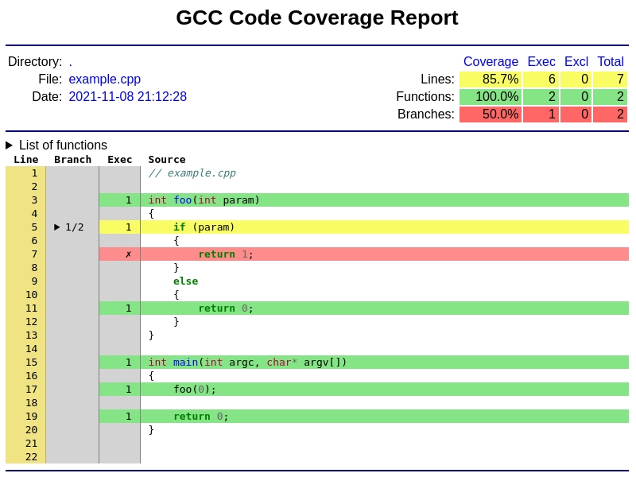
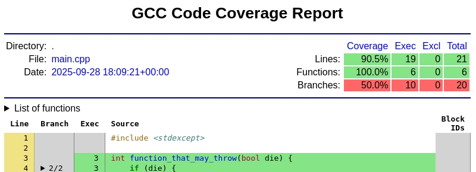
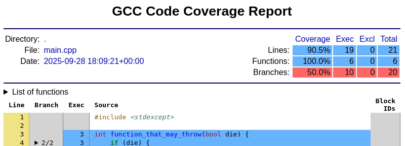
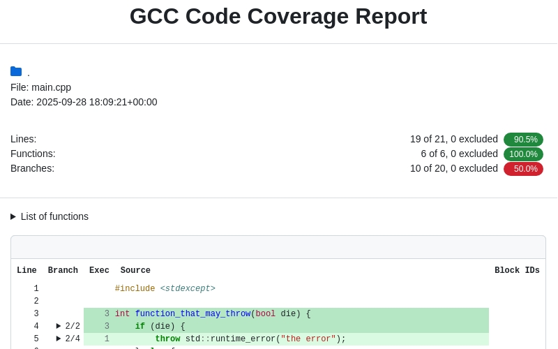
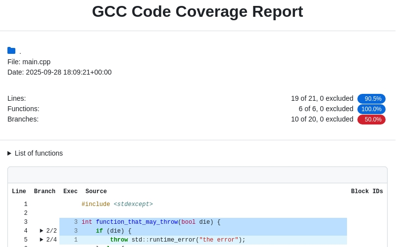
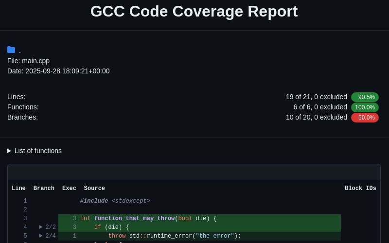

.. _html_output:

HTML Output
===========

The ``gcovr`` command can also generate a simple
HTML output using the :option:`--html<gcovr --html>` option:

.. include:: ../../examples/example_html.sh
    :code: bash
    :start-after: #BEGIN gcovr html
    :end-before: #END gcovr html

This generates a HTML summary of the lines executed.  In this
example, the file ``example_html.html`` is generated, which has the
following output:

.. image:: ../../images/screenshot-html.jpeg
    :align: center

The default behavior of the :option:`--html<gcovr --html>` option is to generate
HTML for a single webpage that summarizes the coverage for all files. The
HTML is printed to standard output, but the :option:`-o/--output<gcovr --output>`
option is used to specify a file that stores the HTML output.

The :option:`--html-details<gcovr --html-details>` option is used to create
a separate web page for each file. Each of these web pages includes
the contents of file with annotations that summarize code coverage. Consider
the following command:

.. include:: ../../examples/example_html.sh
    :code: bash
    :start-after: #BEGIN gcovr html details
    :end-before: #END gcovr html details

This generates the following HTML page for the file ``example.cpp``:

The :option:`--html-nested<gcovr --html-nested>` option is used to create
a separate web page for each file and directory. Each of these web pages includes
the contents of file with annotations that summarize code coverage. Consider
the following command:

Note that the :option:`--html<gcovr --html>` and
:option:`--html-details<gcovr --html-details>` options need
a named output, e.g. via the the :option:`-o/--output<gcovr --output>` option.
For example, if the output is named ``coverage.html``,
then the web pages generated for each file will have names of the form
``coverage.<filename>.html``.

The :option:`--html-self-contained<gcovr --html-self-contained>` option controls
whether assets like CSS styles are bundled into the HTML file.
The :option:`--html<gcovr --html>` report defaults to self-contained mode.
but :option:`--html-details<gcovr --html-details>` and
:option:`--html-nested<gcovr --html-nested>` default to
:option:`--no-html-self-contained<gcovr --html-self-contained>`
in order to avoid problems with the `Content Security Policy <CSP_>`_
of some servers, especially Jenkins.

The :option:`--html-theme<gcovr --html-theme>` option controls the theme and color of html report.

    
    :option:`--html-theme green<gcovr --html-theme>`, :option:`--html-theme default.green<gcovr --html-theme>`

    :option:`--html-theme blue<gcovr --html-theme>`, :option:`--html-theme default.blue<gcovr --html-theme>`

    :option:`--html-theme github.green<gcovr --html-theme>`

    :option:`--html-theme github.blue<gcovr --html-theme>`

    :option:`--html-theme github.dark-green<gcovr --html-theme>`

.. figure:: ../../images/screenshot-html-github-dark-blue-src.jpeg
    :align: center

    :option:`--html-theme github.dark-blue<gcovr --html-theme>`

The :option:`--html-template-dir<gcovr --html-template-dir>` option allows you to use an
alternate directory with Jinja2 templates to fully customize the HTML output in detail.
If a template is missing from this directory the original is used. It is advised that you
start by copying the part you want to modify from
`the existing default theme templates <https://github.com/gcovr/gcovr/tree/main/src/gcovr/formats/html/default>`_
or `the existing github theme templates <https://github.com/gcovr/gcovr/tree/main/src/gcovr/formats/html/github>`_.
Keep in mind the template context data that is passed to these templates *MAY* change
between release versions.

Note that you do not have to copy every single template and can copy and edit only the
templates you wish to customize.

.. _CSP: https://developer.mozilla.org/en-US/docs/Web/HTTP/CSP

.. versionadded:: 7.0
   Added :option:`--html-template-dir<gcovr --html-template-dir>`

.. versionadded:: 6.0
   Added :option:`--html-nested<gcovr --html-nested>`
   and :option:`--html-syntax-highlighting<gcovr --html-syntax-highlighting>`.

.. versionadded:: 5.0
   Added :option:`--html-self-contained<gcovr --html-self-contained>`
   and :option:`--no-html-self-contained<gcovr --html-self-contained>`.

.. versionchanged:: 5.0
   Default to external CSS file for :option:`--html-details<gcovr --html-details>`.
